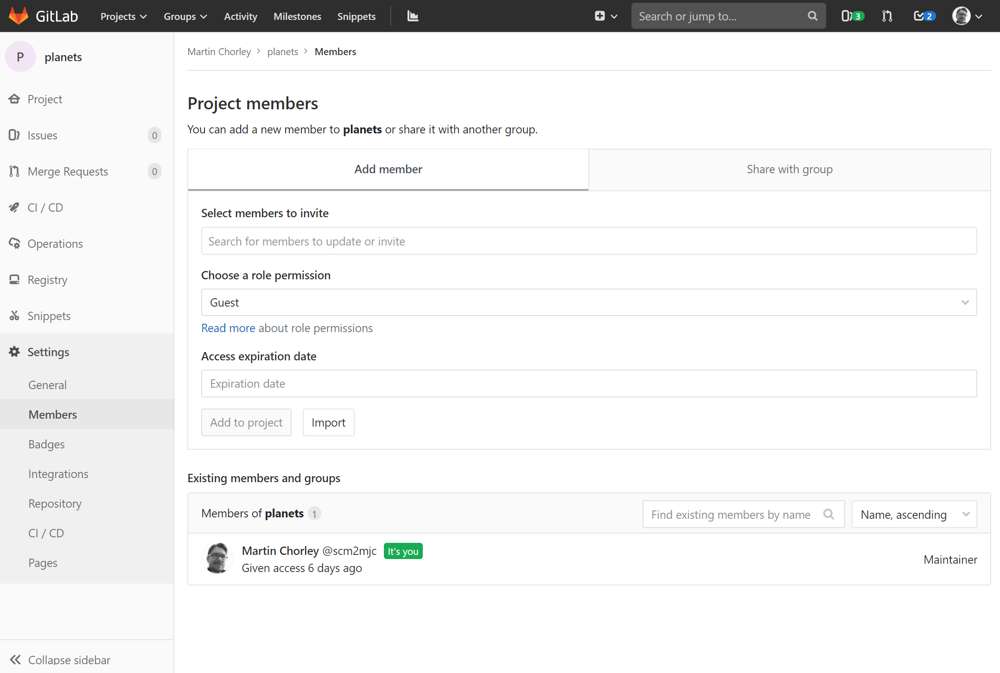
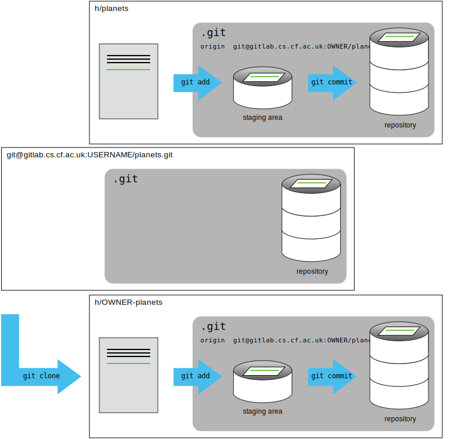

# Collaborating and Gitlab

For the next step, get into pairs. One person will be the "Owner" and the other will be the "Collaborator". The goal is that the Collaborator add changes into the Owner's repository. We will switch roles at the end, so both persons will play Owner and Collaborator.

> ## Practicing By Yourself
>
> If you're working through this lesson on your own, you can carry on by opening
> a second terminal window.
> This window will represent your partner, working on another computer. You
> won't need to give anyone access on GitLab, because both 'partners' are you.

The Owner needs to give the Collaborator access. On GitLab, click the settings button on the left, then select Members, and enter your partner's username.



To accept access to the Owner's repo, the Collaborator needs to respond to a notification on GitLab.

Next, the Collaborator needs to download a copy of the Owner's repository to their machine. This is called "cloning a repo". To clone the Owner's repo into their `Desktop` folder, the Collaborator enters:

```bash
$ git clone git@git.cardiff.ac.uk:USERNAME/planets.git ~/h/USERNAME-planets
```



The Collaborator can now make a change in their clone of the Owner's repository, exactly the same way as we've been doing before:

```bash
$ cd ~/Desktop/vlad-planets
$ nano pluto.txt
$ cat pluto.txt
```

```output
It is so a planet!
```

```bash
$ git add pluto.txt
$ git commit -m "Add notes about Pluto"
```

```output
 1 file changed, 1 insertion(+)
 create mode 100644 pluto.txt
```

Then push the change to the _Owner's repository_ on GitLab:

```bash
$ git push origin master
```

```output
Counting objects: 4, done.
Delta compression using up to 4 threads.
Compressing objects: 100% (2/2), done.
Writing objects: 100% (3/3), 306 bytes, done.
Total 3 (delta 0), reused 0 (delta 0)
To git@git.cardiff.ac.uk:USERNAME/planets.git
   9272da5..29aba7c  master -> master
```

Note that we didn't have to create a remote called `origin`: Git uses this name by default when we clone a repository. (This is why `origin` was a sensible choice earlier when we were setting up remotes by hand.)

Take a look to the Owner's repository on its GitLab website now (maybe you need to refresh your browser.) You should be able to see the new commit made by the Collaborator.

To download the Collaborator's changes from GitLab, the Owner now enters:

```bash
$ git pull origin master
```

```output
remote: Counting objects: 4, done.
remote: Compressing objects: 100% (2/2), done.
remote: Total 3 (delta 0), reused 3 (delta 0)
Unpacking objects: 100% (3/3), done.
From git@git.cardiff.ac.uk:USERNAME/planets.git
 * branch            master     -> FETCH_HEAD
Updating 9272da5..29aba7c
Fast-forward
 pluto.txt | 1 +
 1 file changed, 1 insertion(+)
 create mode 100644 pluto.txt
```

Now the three repositories (Owner's local, Collaborator's local, and Owner's on GitLab) are back in sync.

> ## A Basic Collaborative Workflow
>
> In practice, it is good to be sure that you have an updated version of the repository you are collaborating on, so you should `git pull` before making our changes. The basic collaborative workflow would be:
>
> -   update your local repo with `git pull origin master`,
> -   make your changes and stage them with `git add`,
> -   commit your changes with `git commit -m`, and
> -   upload the changes to GitLab with `git push origin master`
>
> It is better to make many commits with smaller changes rather than of one commit with massive changes: small commits are easier to read and review.

&nbsp;

> ## Switch Roles and Repeat
>
> Switch roles and repeat the whole process.

&nbsp;

> ## Comment Changes in GitLab
>
> The Collaborator has some questions about one line change made by the Owner and has some suggestions to propose.
>
> With GitLab, it is possible to comment the diff of a commit. Over the line of code to comment, a blue comment icon appears to open a comment window.
>
> The Collaborator posts their comments and suggestions using the GitLab interface.

&nbsp;

> ## Version History, Backup, and Version Control
>
> Some backup software can keep a history of the versions of your files. They also
> allows you to recover specific versions. How is this functionality different from version control?
> What are some of the benefits of using version control, Git and GitLab?
