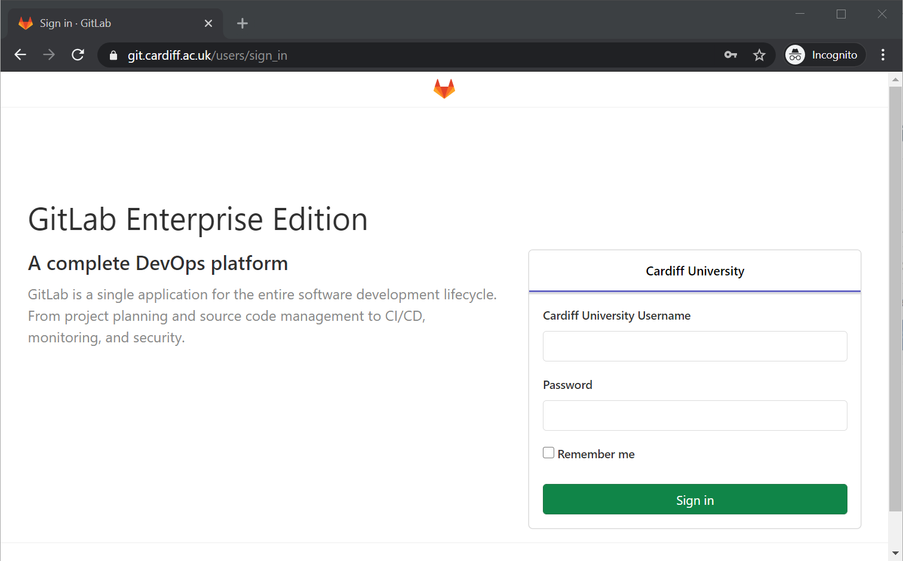
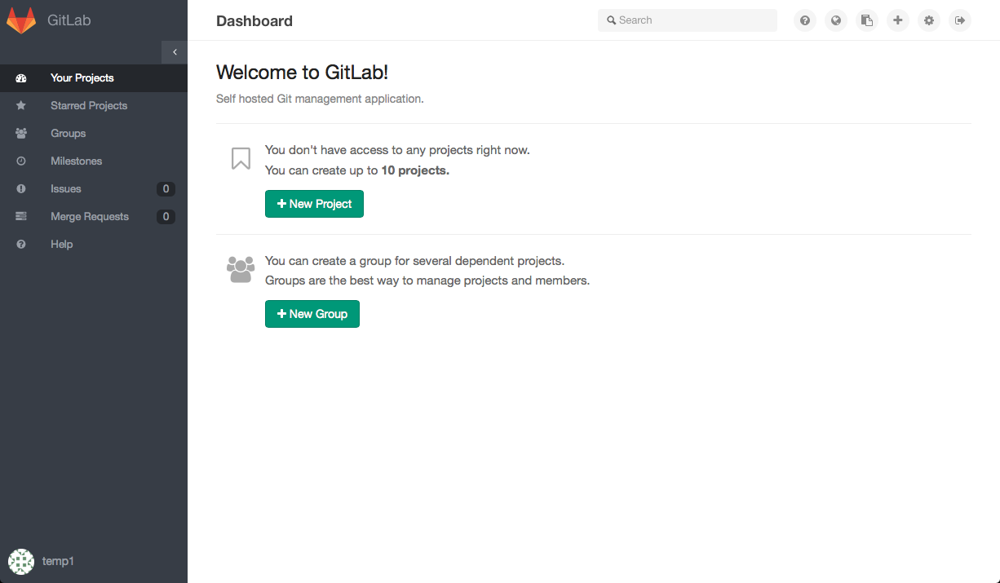
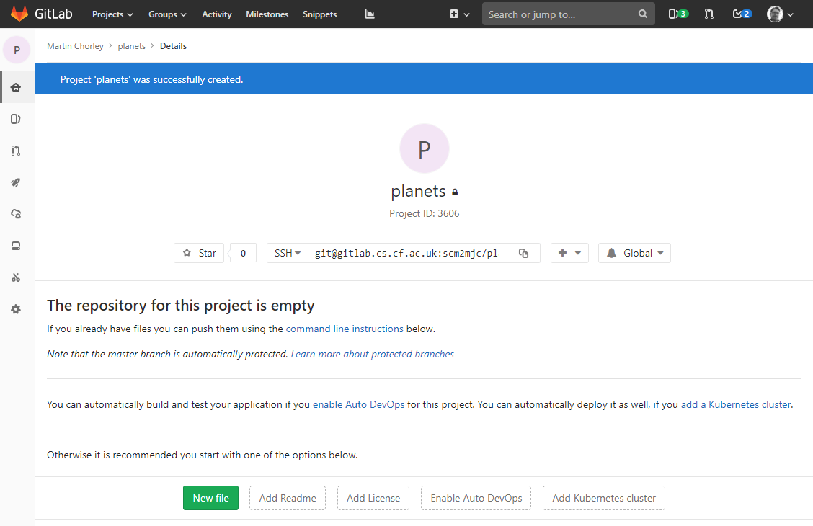
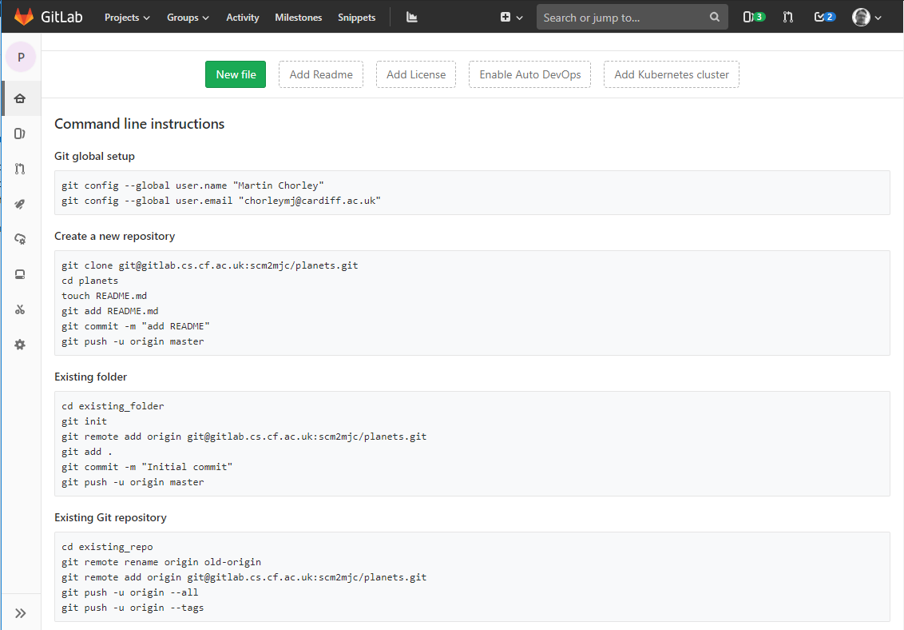
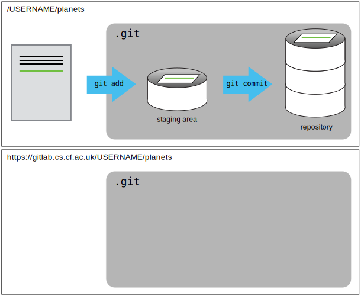
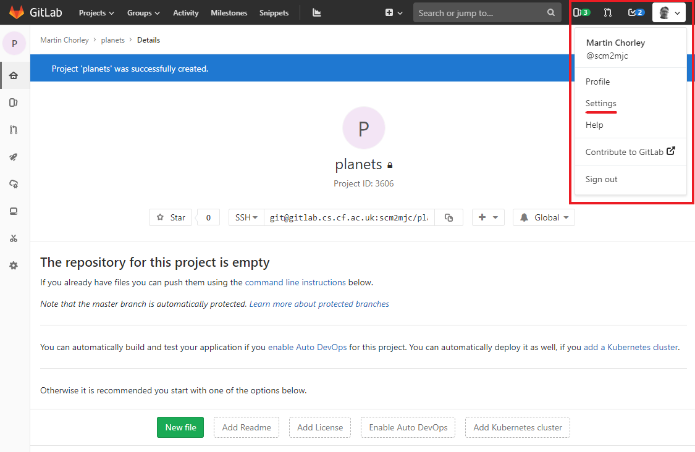
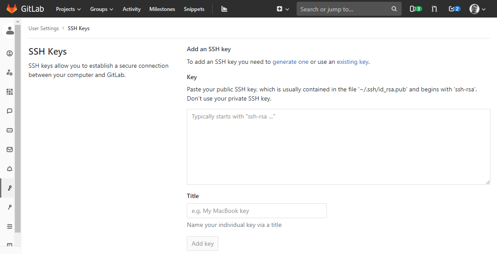
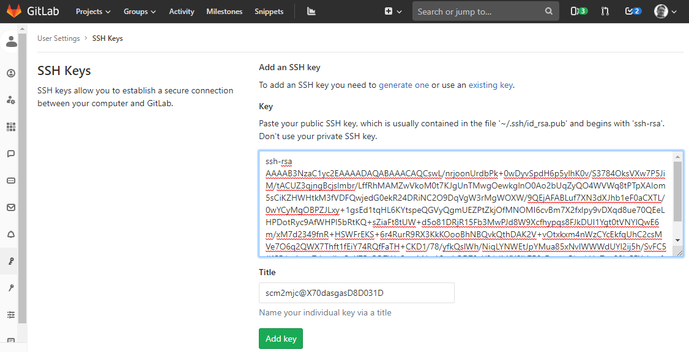
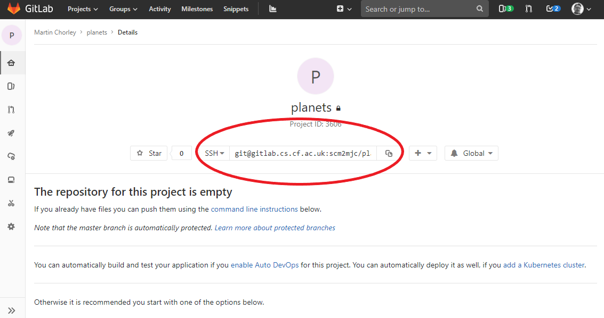
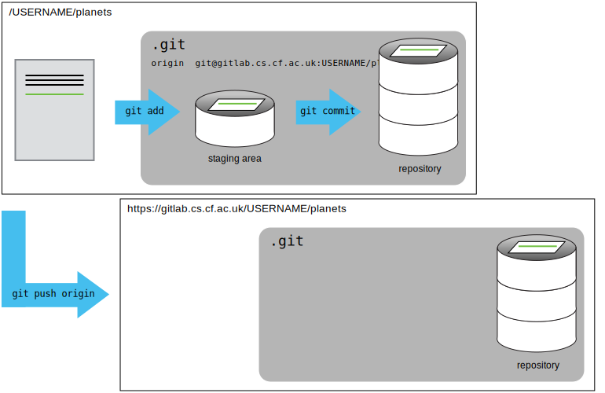

# Gitlab

Version control really comes into its own when we begin to collaborate with other people. We already have most of the machinery we need to do this; the only thing missing is to copy changes from one repository to another.

Systems like Git allow us to move work between any two repositories. In practice, though, it's easiest to use one copy as a central hub, and to keep it on the web rather than on someone's laptop. Most programmers use hosting services like [GitLab](https://gitlab.com), [BitBucket](https://bitbucket.org) or [Github](https://github.com/) to hold those central copies. All these services provide a level of functionality for free. In the School of Computer Science & Informatics we provide our own [university hosted version of GitLab](https://git.cardiff.ac.uk), available at [https://git.cardiff.ac.uk](https://git.cardiff.ac.uk).

!> In addition to the notes in this course there is an introduction to the School's Gitlab server in the [Introductory documents](https://docs.cs.cf.ac.uk/notes/using-gitlab/)

Let's start by sharing the changes we've made to our current project with the world. Head to the School's GitLab website, and log in using your standard university username and password on the LDAP tab on the 'Sign In' box.



If you've not logged in previously and have no projects, the Welcome screen will be displayed. From here you can click the 'New Project' button to create a new Project. This project will be used to score a copy of our Git repository.



On the 'New Project' screen you need to give your project a name in the 'Project Name' field. You can also add an optional description for the project. The 'Visibility Level' option allows you to set the visibility of the project. A 'private' project is only visible to you, although you can explicitly choose to give other individuals access to the project later. An 'internal' project will be visible to all users logged in to the GitLab server. Public visibility would allow the project to be seen by anyone, but this option is not permitted in the University's GitLab instance. The final option would allow us to add a README file to the new project.

?> Create a new Project called 'planets'

!> Do NOT tick the 'initialize repository with a README' option this time

As soon as the repository is created, GitLab displays a page with some information about the project:



If you scroll down, you will see a lot of information about how to add files to your repository:



This 'New Project' process has effectively done the following on the GitLab server:

```bash
$ mkdir planets
$ cd planets
$ git init
```

If you remember back to the earlier [lesson](changes/) where we added and commited our earlier work on `mars.txt`, we had a diagram of the local repository which looked like this:


Now that we have two repositories, we need a diagram like this:



Note that our local repository still contains our earlier work on `mars.txt`, but the remote repository on GitLab appears empty as it doesn't contain any files yet.

Before we can connect our local repository with the remote repository on GitLab, we need to identify our local account to the remote server and authorise it to make changes to our GitLab projects.

Click on the profile link in the top right corner, then 'Settings' to access your profile settings page:



Then click on 'SSH Keys' in the left hand menu:



Create a public/private key pair with the following command in the command line:

```bash
ssh-keygen -t rsa -b 4096
```

Accept the default location to save the key by pressing `return` and enter a passphrase if you wish.

!> If you add a passphrase you will have to type this each time you wish to use the key.

Once you have the public/private key pair you can copy the public key. You can do this in the command line by running:

```bash
cat ~/.ssh/id_rsa.pub
```

The outputted text should begin with `ssh-rsa` and look a little something like this:

```output
ssh-rsa AAAAB3NzaC1yc2EAAAADAQABAAACAQCswL/nrjoonUrdbPk+0wDyvSpdH6p5ylhK0v/S3784OksVXw7P5JiM/tACUZ3qjngBcjslmbr/LffRhMAMZwVkoM0t7KJgUnTMwgOewkglnO0Ao2bUqZyQO4WVWq8tPTpXAIom5sCiKZHWHtkM3fVDFQwjedG0ekR24DRiNC2O9DqVgW3rMgWOXW/9QEjAFABLuf7XN3dXJhb1eF0aCXTL/0wYCyMgOBPZJLxy+1gsEd1tqHL6KYtspeQGVyQgmUEZPtZkjOfMNOMI6cvBm7X2fxlpy9vDXqd8ue70QEeLHPDotRyc9AfWHPl5bRtKQ+sZiaFt8tUW+d5o81DRjR15Fb3MwPJd8W9Xcfhypqs8FJkDUI1Ygt0tVNYlQwE6m/xM7d2349fnR+HSWFrEKS+6r4RurR9RX3KkKOooBhNBQvkQthDAK2V+vOtxkxm4nWzCYcEkfqUhC2csMVe7O6q2QWX7Thft1fEiY74RQfFaTH+CKD1/78/yfkQslWh/NiqLYNWEtJpYMua85xNvlWWWdUYl2ij5h/SvFC5JKCR/pxjro+Tshs;dlwCnK7Bv5Q7Wp3mxM1gA3qtkODT0eY81dMfX8ik7F6xDvmwRha/rUuZvq22jx5FXcbaxfyAFzCa1oMDSu01ahLdZi0sPY2aFu7MFGcFVc6nCA8GqoETupugda0Q== scm2mjc@X70dasgasD8D031D
```

Select all this output, and copy it. Now paste it into the 'Key' box in the 'SSH Keys' page on GitLab, and click 'Add Key'.



Your account on the local machine is now linked to your profile on the GitLab server, and you will be able to add code to and retrieve code from the GitLab server. If you have additional machines you would like to link, you can do this in the same way.

!> Note - you will need to be connected to the University VPN to be able to push code to the Gitlab server

Now that our account is authorised to access our project, the next step is to connect the two repositories. We do this by making the GitLab repository a [remote](reference#remote) for the local repository. The home page of the repository on GitLab includes the string we need to identify it:



Copy that URL from the browser, go into the local `planets` repository on the command line, and run this command:

```bash
$ git remote add origin git@gitlab.cs.cf.ac.uk:USERNAME/planets.git
```

Make sure to use the URL for your repository rather than the one above: the only difference should be your username instead of `USERNAME`.

We can check that the command has worked by running `git remote -v`:

```bash
$ git remote -v
```

```output
origin   git@gitlab.cs.cf.ac.uk:USERNAME/planets.git (push)
origin   git@gitlab.cs.cf.ac.uk:USERNAME/planets.git (fetch)
```

The name `origin` is a local nickname for your remote repository. We could use something else if we wanted to, but `origin` is by far the most common choice.

Once the nickname `origin` is set up, this command will push the changes from our local repository to the repository on GitLab:

```bash
$ git push origin master
```

```output
Counting objects: 9, done.
Delta compression using up to 4 threads.
Compressing objects: 100% (6/6), done.
Writing objects: 100% (9/9), 821 bytes, done.
Total 9 (delta 2), reused 0 (delta 0)
To  git@gitlab.cs.cf.ac.uk:USERNAME/planets.git
 * [new branch]      master -> master
Branch master set up to track remote branch master from origin.
```

Our local and remote repositories are now in this state:



> ### The '-u' Flag
>
> You may see a `-u` option used with `git push` in some documentation. This
> option is synonymous with the `--set-upstream-to` option for the `git branch`
> command, and is used to associate the current branch with a remote branch so
> that the `git pull` command can be used without any arguments. To do this,
> use `git push -u origin master` once the remote has been set up.

We can pull changes from the remote repository to the local one as well:

```bash
$ git pull origin master
```

```output
From  git@gitlab.cs.cf.ac.uk:USERNAME/planets.git
 * branch            master     -> FETCH_HEAD
Already up-to-date.
```

Pulling has no effect in this case because the two repositories are already synchronized. If someone else had pushed some changes to the repository on GitLab, though, this command would download them to our local repository.

> ## GitLab GUI
>
> Browse to your `planets` repository on GitLab. Under the Code tab, find and click on the text that says “commits (XX)” (where “XX” is some number). What information can you gather/explore from this page? How would you get that same information in the shell?

&nbsp;

> ## Push vs. Commit
>
> In this lesson, we introduced the “git push” command. How is “git push” different from “git commit “?
>
> #### Solution
>
> When we push changes, we're interacting with a remote repository to update it with the changes we've made locally (often this corresponds to sharing the changes we've made with others). Commit only updates your local repository.

&nbsp;

> ## GitLab README files
>
> In this section we learned about creating a remote repository on GitLab, but when you initialised your GitLab repo, you didn't add a README.md file. If you had, what do you think would have happened when you tried to link your local and remote repositories?
>
> #### Solution
>
> In this case, we'd see a merge conflict due to unrelated histories. When GitLab creates a README.md file, it performs a commit in the remote repository. When you try to pull the remote repository to your local repository, Git detects that they have histories that do not share a common origin and refuses to merge.
>
> ```bash
> $ git pull origin master
> ```
>
> ```output
> From git@gitlab.cs.cf.ac.uk:USERNAME/planets.git
>  * branch            master     -> FETCH_HEAD
>  * [new branch]      master     -> origin/master
> fatal: refusing to merge unrelated histories
> ```
>
> You can force git to merge the two repositories with the option `--allow-unrelated-histories`. Be careful when you use this option and carefully examine the contents of local and remote repositories before merging.
>
> ```bash
> $ git pull --allow-unrelated-histories origin master
> ```
>
> ```output
> From git@gitlab.cs.cf.ac.uk:USERNAME/planets.git
>  * branch            master     -> FETCH_HEAD
> Merge made by the 'recursive' strategy.
>  README.md | 1 +
>  1 file changed, 1 insertion(+)
>  create mode 100644 README.md
> ```

If you `commit` work on one machine then `push` it to a remote repository, you can move to a completely new machine, `pull` the code from the remote repository (or `clone` the repository if you don't have a local copy), and carry on where you left off.

You can now use Git locally to track, view and restore changes to files, and push your changes to a remote repository so that you can have your work stored in a second location, enable collaboration, and share work between different machines.
